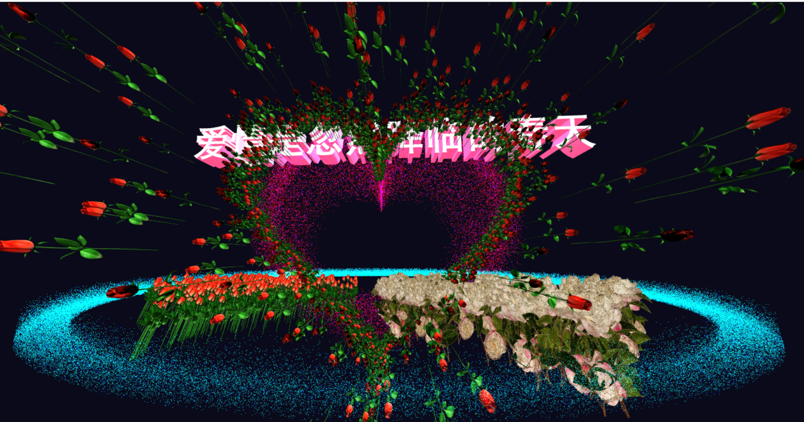

# HeartAndLove
a flying  3D heart  model   implemented  using  THREEJS  

# 3D Love Heart Interactive Artwork

  This project implements an immersive love-themed interactive experience using Three.js 3D graphics framework. The core features include:
A parametric heart-shaped geometry model with vertex shaders enabling dynamic luminous materials and breathing-scale animations

Dual particle systems:
Rose vines growing along curved paths around the heart
Cherry blossom petals and peony flowers arranged in heart-shaped patterns beneath the core structure
3D typography rendering with perspective-responsive particle halos along text trajectories

Technical breakthroughs in:
Three-dimensional coordinate transformation
Vertex animation blending
Collision-free particle pathfinding algorithms

Through mathematical parameterization of emotional expressions, this artwork pushes WebGL visualization boundaries while demonstrating my evolution from functional coding to aesthetic engineering. The romantic atmosphere is enhanced by synchronized elements: rotating heart structure, floating petals, and glowing love poetry that dynamically interacts with viewing angles.

Key Implementation Details
Optimized rendering pipeline handling 300K+ particles at 40+ FPS
GLSL shaders for organic material transitions
Physics-based petal motion using Verlet integration
SVG-to-3D conversion for floral patterns

# Contact me 
Contact: 2756447543@qq.com 
License: MIT License © 2025 [xujuZhong]

# Runtime Demo

